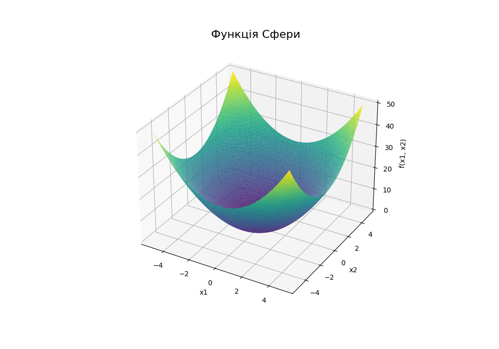

## Завдання "Локальний пошук, евристики та імітація відпалу"

**Опис завдання**

Реалізуйте програму для мінімізації функції Сфери $f(x) = \sum_{i=1}^{n} x_i^2$ використовуючи три різні підходи до локальної оптимізації:

- Алгоритм «Підйом на гору» (`Hill Climbing`)
- Випадковий локальний пошук (`Random Local Search`)
- Імітацію відпалу (`Simulated Annealing`)



**Технічні умови**

1. Межі функції визначаються як $x_i \in [-5, 5]$ для кожного параметра $x_i$.

2. Алгоритми повинні повертати оптимальну точку (список координат $x$) та значення функції в цій точці.

3. Реалізуйте три методи оптимізації:

- `hill_climbing` — алгоритм підйому на гору.
- `random_local_search` — випадковий локальний пошук.
- `simulated_annealing` — імітація відпалу.

4. Кожен алгоритм має приймати параметр `iterations`, який визначає максимальну кількість ітерацій для виконання алгоритму.

5. Алгоритми повинні завершувати виконання за однією з умов:

- Зміна значення цільової функції або положення точки в просторі розв'язків між двома послідовними ітераціями стає меншою за `epsilon`, де `epsilon` є параметром точності і визначає чутливість алгоритму до незначних покращень.
- Для алгоритму відпалу враховується температура: якщо температура зменшується до значення меншого за `epsilon`, алгоритм завершує виконання, оскільки це вказує на вичерпання пошукової здатності алгоритму.

**Шаблон програми**

```
import random
import math


# Визначення функції Сфери
def sphere_function(x):
  return sum(xi ** 2 for xi in x)


# Hill Climbing
def hill_climbing(func, bounds, iterations=1000, epsilon=1e-6):
  pass


# Random Local Search
def random_local_search(func, bounds, iterations=1000, epsilon=1e-6):
  pass


# Simulated Annealing
def simulated_annealing(func, bounds, iterations=1000, temp=1000, cooling_rate=0.95, epsilon=1e-6):
  pass


if __name__ == "__main__":
  # Межі для функції
  bounds = [(-5, 5), (-5, 5)]

  # Виконання алгоритмів
  print("Hill Climbing:")
  hc_solution, hc_value = hill_climbing(sphere_function, bounds)
  print("Розв'язок:", hc_solution, "Значення:", hc_value)

  print("\nRandom Local Search:")
  rls_solution, rls_value = random_local_search(sphere_function, bounds)
  print("Розв'язок:", rls_solution, "Значення:", rls_value)

  print("\nSimulated Annealing:")
  sa_solution, sa_value = simulated_annealing(sphere_function, bounds)
  print("Розв'язок:", sa_solution, "Значення:", sa_value)
```

**Приклад виконання**

```
Hill Climbing:
Розв'язок: [0.0005376968388007969, 0.0007843237077809137] Значення: 9.042815690435702e-07

Random Local Search:
Розв'язок: [0.030871215407484165, 0.10545563391334589] Значення: 0.012073922664800917

Simulated Annealing:
Розв'язок: [0.024585173708439823, -0.00484719941675793] Значення: 0.0006279261084599791
```
